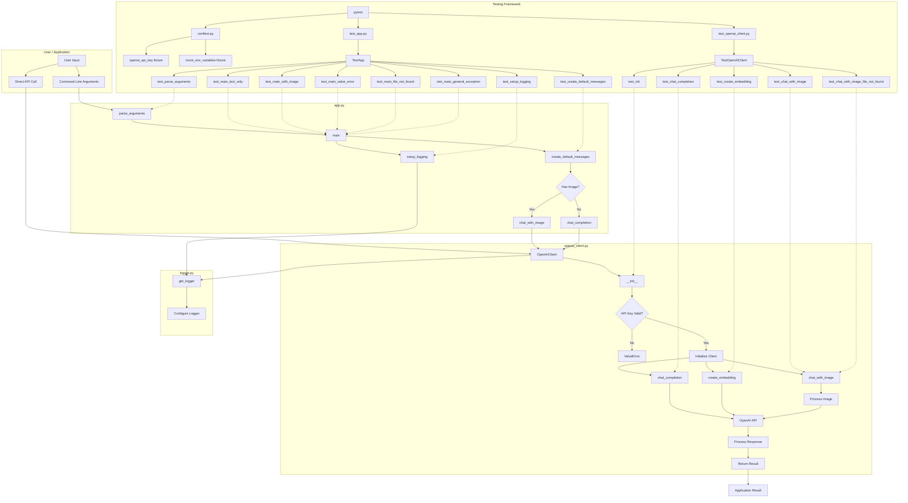
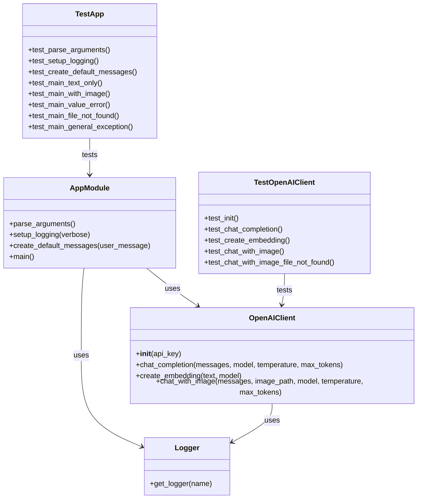

# Production-Ready OpenAI Client

A robust, production-ready OpenAI client implementation with comprehensive testing.

## Overview

This project demonstrates how to build a robust, production-ready OpenAI API client with proper testing. The implementation includes:

- A fully-featured OpenAI client class supporting chat completions, embeddings, and vision capabilities
- Command-line interface for interacting with the API
- Comprehensive testing suite with unit tests and integration tests
- Proper error handling and logging

## Installation

1. Clone this repository
2. Create a virtual environment:
   ```
   python -m venv venv
   source venv/bin/activate  # On Windows: venv\Scripts\activate
   ```
3. Install dependencies:
   ```
   pip install -r requirements.txt
   ```

## Usage

### Setting Up API Keys

Set your OpenAI API key as an environment variable:

```bash
export OPENAI_API_KEY="your-api-key-here"
```

Or use a `.env` file (recommended for development):

```
OPENAI_API_KEY=your-api-key-here
```

### Basic Usage

```python
from openai_client import OpenAIClient

# Initialize client
client = OpenAIClient()

# Use chat completion
messages = [
    {"role": "system", "content": "You are a helpful medical assistant."},
    {"role": "user", "content": "Explain hypertension in simple terms."}
]

response = client.chat_completion(
    messages=messages,
    model="gpt-4o",
    temperature=0.7,
    max_tokens=1000
)

print(response["choices"][0]["message"]["content"])
```

### Command Line Interface

The package includes a command-line interface for easy interaction:

```bash
python main.py --message "Explain diabetes management" --model gpt-4o --temperature 0.7
```

For vision capabilities:

```bash
python main.py --message "Describe what you see in this medical image" --image path/to/image.jpg
```

## Testing

### Running Tests

Run all tests:

```bash
pytest
```

Run only unit tests:

```bash
pytest -m "not integration"
```

Run integration tests (requires valid API key):

```bash
RUN_INTEGRATION_TESTS=1 pytest -m integration
```

Generate coverage report:

```bash
pytest --cov=medagentsim
```

## Project Structure

```
openai-client/
├── openai_client.py     # The OpenAI client implementation
├── logger.py            # Logging utilities
├── main.py              # Command-line interface
├── requirements.txt     # Project dependencies
├── pytest.ini           # Pytest configuration
└── tests/
    ├── conftest.py      # Test fixtures and configuration
    ├── test_openai_client.py  # Unit tests
    └── test_integration_openai_client.py  # Integration tests
```

## Best Practices Implemented

1. **Robust Error Handling**: All API calls are properly wrapped with try/except blocks
2. **Proper Logging**: Detailed logging for debugging and monitoring
3. **Type Annotations**: Full type hints for better IDE support and code quality
4. **Comprehensive Testing**: Unit tests with mocks and integration tests for end-to-end validation
5. **Configurable Parameters**: All client methods support customization of model parameters
6. **Environment Variable Support**: API keys can be passed directly or via environment variables
7. **Clear Documentation**: Docstrings and README provide complete usage information

## Architecture and Flow Diagrams

### Application Flow Diagram

The following diagram illustrates the flow of data and control through the OpenAI client system, including the testing framework:



### Component Relationship Diagram

This diagram shows the relationships between the main components of the system:



## License

MIT